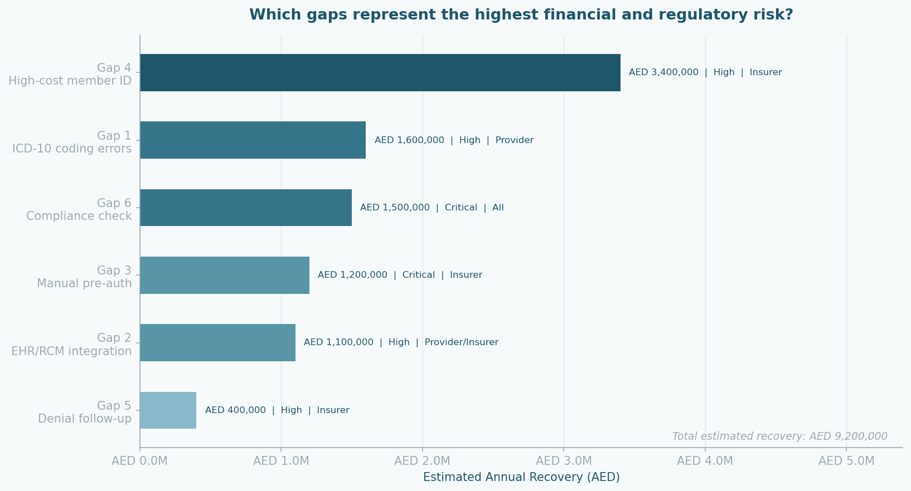
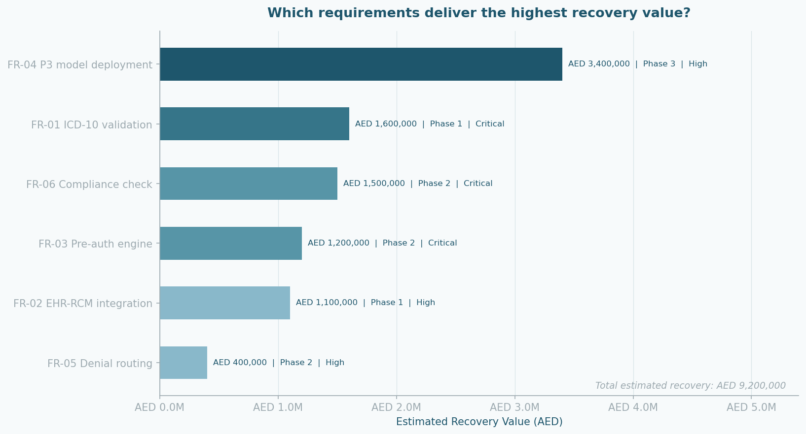

# Project 4 — EHR Workflow Redesign BRD

A compliance-driven Business Requirements Document for redesigning the EHR-to-insurer claims workflow at a leading UAE health insurer. The current workflow is manual and non-compliant — a **33.6% denial rate** across **4,500 claims** and **AED 7.55M** in unrecovered revenue.

This project identifies **6 gaps** across Provider, Insurer, and Regulator, quantifies each one's financial impact, and turns them into a formal BRD with full requirements traceability — **AED 9.2M** in total recoverable value across 3 delivery phases.

---

## The 6 Gaps → AED 9.2M Recovery

| Gap | Party | Recovery | Risk |
|---|---|---|---|
| ICD-10 coding errors | Provider | AED 1,600,000 | High |
| No EHR/RCM integration | Provider/Insurer | AED 1,100,000 | High |
| Manual pre-authorisation | Insurer | AED 1,200,000 | Critical |
| No high-cost member ID | Insurer | AED 3,400,000 | High |
| No automated denial follow-up | Insurer | AED 400,000 | High |
| No pre-submission compliance check | All parties | AED 1,500,000 | Critical |

Each gap traces to a functional requirement (FR-01 → FR-06) and a delivery phase. Full derivations are in [`notebooks/02_gap_analysis.ipynb`](notebooks/02_gap_analysis.ipynb).

---

## Delivery in 3 Phases

| Phase | Scope | Timeline | Recovery |
|---|---|---|---|
| **1 — Foundation** | ICD-10 validation + EHR-RCM integration | Months 1–3 | AED 2.7M |
| **2 — Automation** | Pre-auth engine + denial routing + compliance check | Months 4–6 | AED 3.1M |
| **3 — Intelligence** | P3 predictive model deployment (AUC 0.950) | Months 7–9 | AED 3.4M |

---

## The BRD

| Document | What's inside |
|---|---|
| [Full Confluence Export](brd/BRD_full_Confluence.pdf) | 14 sections — stakeholder register, FR-01→FR-06 traceability, 17 non-functional requirements, assumptions, constraints, sign-off matrix |
| [Executive Summary](brd/BRD_summary.pdf) | 7-page quick-read — gaps, Jira epics, phases, financial case |

Delivered as **6 Epics / 18 user stories** in Jira and a **live Tableau KPI dashboard** → [view dashboard](https://public.tableau.com/app/profile/amr.thabet/viz/EHRWorkflowRedesignBRDKPIDashboard/EHRWorkflowRedesignBRDKPIDashboard).

> Note: the Jupyter notebooks may show GitHub's "An error occurred" preview on large files. Open them via [nbviewer](https://nbviewer.org/github/AmrThabetA/ehr-workflow-redesign/tree/main/notebooks/) if so, or click **Raw**.

---

## Regulatory Context

DHA (Dubai · Shafafiya portal) · DoH/HAAD (Abu Dhabi) · eSMA · mandatory ICD-10 coding · mandatory inpatient pre-auth · hard 90-day submission window.

**Tools:** `Python` · `pandas` · `scikit-learn` · `SQL` · `Tableau` · `Jira` · `Confluence` · `Visio`

---

## Healthcare Analytics Portfolio (4 projects)

| Project | Topic | Link |
|---|---|---|
| P1 | UAE Claims Denial Analysis | [GitHub](https://github.com/AmrThabetA/healthcare-claims-analysis) |
| P2 | RCM Performance Dashboard | [Tableau](https://public.tableau.com/app/profile/amr.thabet/viz/UAE-MENA-RCM-Dashboard/UAEMENARCMPerformanceDashboard2023-2024) |
| P3 | Chronic Disease Cost Modelling | [GitHub](https://github.com/AmrThabetA/chronic-disease-cost-modelling) |
| **P4** | **EHR Workflow Redesign BRD** | **This repo** |
| ✨ | Interactive Visual Suite | [Live dashboard](https://amrthabeta.github.io/portfolio-visuals/src/visual_suite.html) |

---

*Amr Thabet · Healthcare Data & Business Analyst · Abu Dhabi, UAE · [GitHub](https://github.com/AmrThabetA)*
